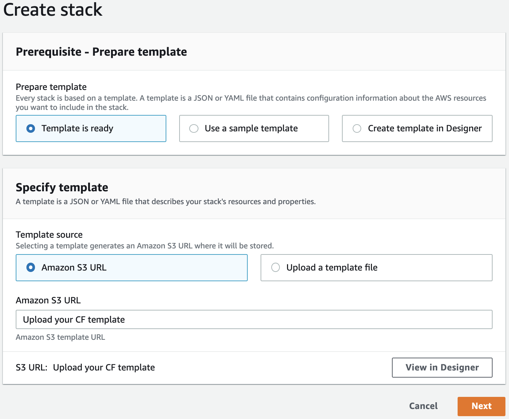
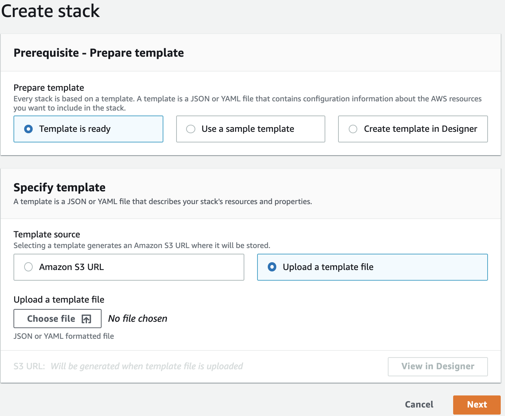
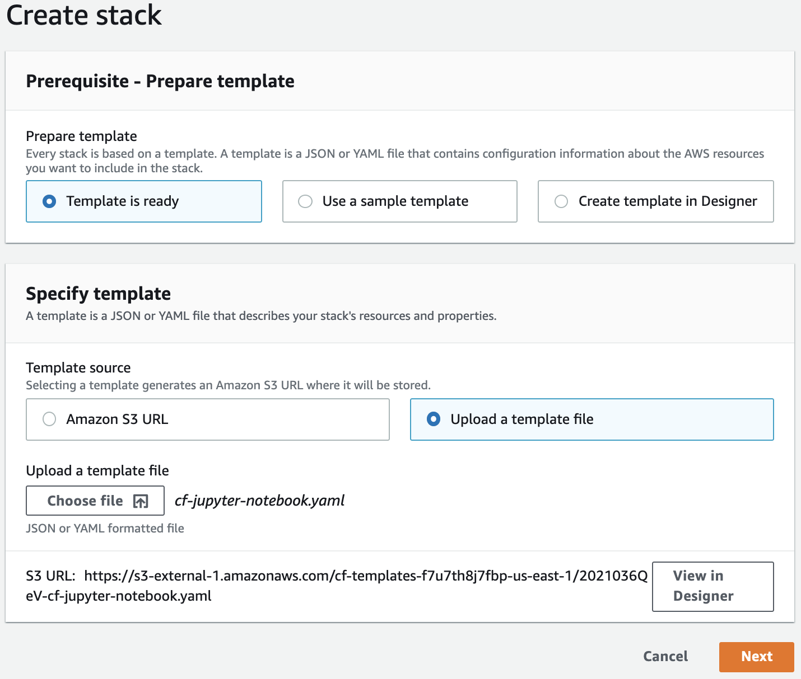
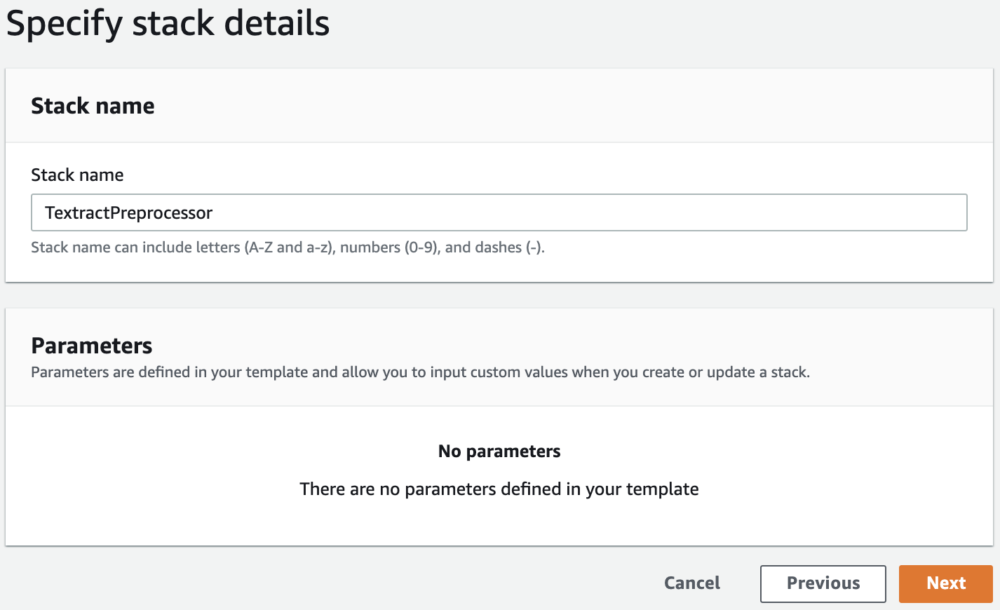

# Amazon Textract Pre-Processing: Handling Visuals

# Installation

1. Create a Jupyter Notebook instance clicking one of the launch stack buttons

| AWS Region  |                                                                                                       Button                                                                                                        |
| :---------: | :-----------------------------------------------------------------------------------------------------------------------------------------------------------------------------------------------------------------: |
| _us-east-1_ | [](https://console.aws.amazon.com/cloudformation/home?region=us-east-1#/stacks/new?stackName=TextractPreprocessor&templateURL=Upload%20your%20CF%20template) |

2. Sign in to the [AWS Management Console](https://aws.amazon.com/console/) with your IAM user name and password. You will get a screen like this:



3. Click on Template source >> Upload a template file, and the Choose File button.



4. Upload the cf-jupyter-notebook.yaml CloudFormation template located in the cftemplate directory of this project



5. Click the next button in the Create Stack Page
   
6. Set the Stack name as you prefer, and click on the Next button
7. Click the Next button in the Configure stack options
8. In the review page, scroll down and acknowledge the IAM resource creation and click on the Create Stack button

# Jupyter Notebook configuration

1. After the stack creation finishes, go to the Outputs section, and click on the link corresponding to the value of the NotebookInstanceName Key
2. Click the Open Jupyter Button
3. In the Jupyter notebook, Click on New > Terminal, and switch to the terminal tab created in your browser
4. Type the following commands:

   ```console
   sh-4.2$ cd Sagemaker
   sh-4.2$ git clone https://github.com/vicrojo/textract-preprocessor
   ```

# Code Samples Review

1. Go to the home page of your Jupyter notebook and browse to the textract-preprocessor directory
2. Open the Jupyter notebooks inside this directory to run the detailed options mentioned in the Blog Post

# Cleaning up

1. After you finished your tests, just got to CloudFormation, select the name of the stack created on the Step 6 of the first section, and click on the Delete button.
2. Confirm the Stack deletion clicking on the Delete stack button
